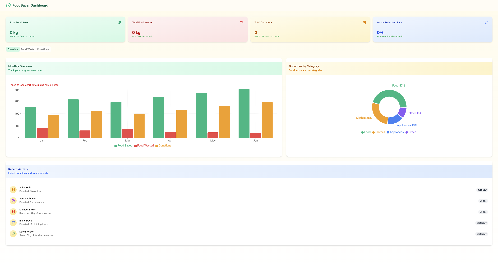
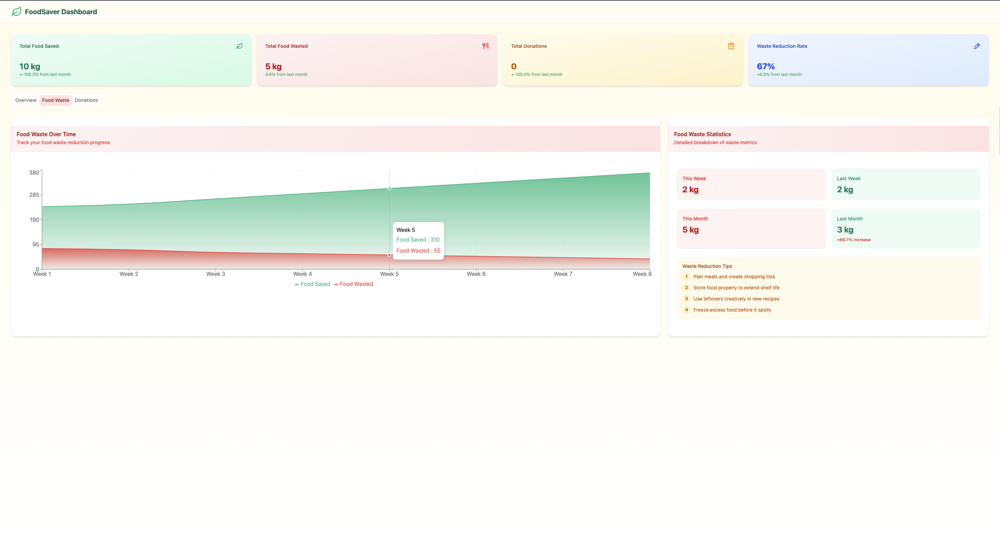
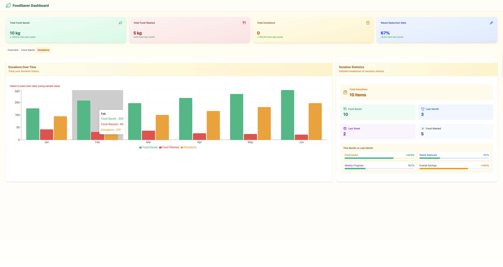

# FoodSaver Dashboard

The "FoodSaver Dashboard" is a responsive web application designed to visualize data related to food donations, waste tracking, and reduction efforts. This full-stack project showcases a dynamic user interface powered by React and a backend service built with Spring Boot and H2 in-memory database.

## Features

- Real-time dashboard to monitor:
  - Total food saved
  - Total food wasted
  - Total donations
  - Waste reduction rate
- Tabbed views for:
  - Overview with bar and pie charts
  - Food waste tracking over time
  - Donation history and statistics
- Sample data visualization for demo purposes
- Clean, minimalist UI with category breakdowns and activity feed

## Tech Stack

### Frontend
- React (with Vite)
- TypeScript
- Tailwind CSS for styling
- Chart.js / Recharts for data visualizations

### Backend
- Spring Boot
- Java
- H2 Database (in-memory, used for demo data)
- Maven for build automation

## Run Locally

### Prerequisites
- Node.js & npm (for frontend)
- Java 17+ (for backend)

### Frontend Setup
```bash
cd frontend
npm install
npm run dev
```

### Backend Setup
```bash
java -jar zero.jar


> The backend will run on `localhost:8080` and the frontend on `localhost:3000`.

## Preview





## Notes

- This dashboard runs fully with sample data in memory, making it suitable for demonstration or local testing without additional setup.
- No authentication/login is implemented in this version.
```
